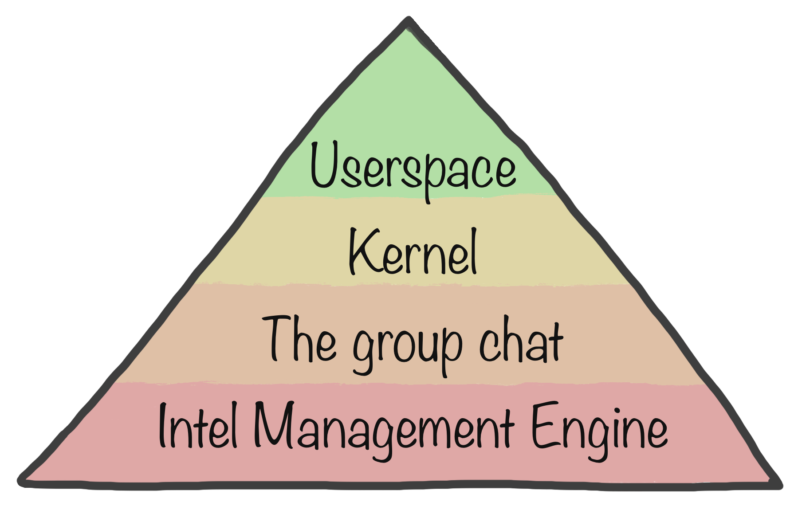
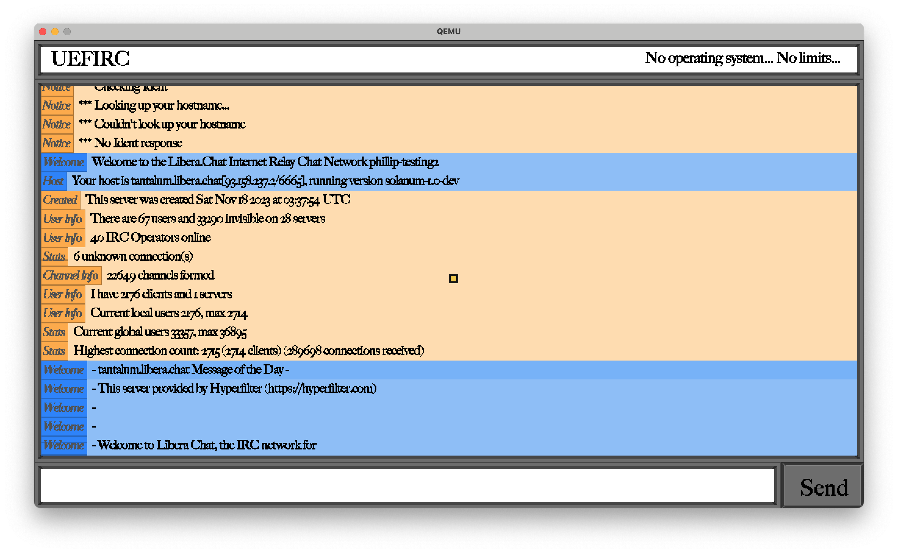
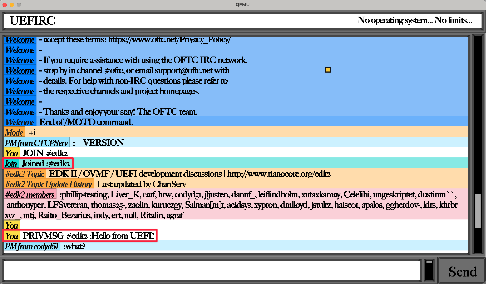

<p align="center">
  
</p>

UEFIRC is a graphical UEFI IRC client. Connect to an IRC server, chat and read messages, all from the comfort of your motherboard's pre-boot environment.

_50 years of computing, yet no solution for IRC software that can also fry your motherboard. Until now._

<p align="center">
  
</p>  

UEFIRC is written in Rust and leverages [uefi-rs](https://github.com/rust-osdev/uefi-rs). 

The GUI toolkit comes from [axle OS](https://github.com/codyd51/axle). I think that this is the first time anyone has put TrueType in UEFI.

_NO kernel. NO GUI toolkit. NO scheduler. NO memory protection. Just you, the motherboard firmware, and all your pals across the internet._

https://github.com/codyd51/uefirc/assets/4972184/123da2d1-f99f-49c3-9850-8ce2f5be31de

UEFIRC comes with keyboard and mouse support by leveraging UEFI's [Simple Text Protocol](https://uefi.org/specs/UEFI/2.9_A/12_Protocols_Console_Support.html#efi-simple-text-input-protocol) and [Simple Pointer Protocol](https://uefi.org/specs/UEFI/2.9_A/12_Protocols_Console_Support.html#simple-pointer-protocol).

Most notably, UEFIRC implements a memory-safe wrapper around UEFI's TCP implementation. 

Here's me saying hello to the UEFI development chat from UEFI itself.

<p align="center">
  
</p>

UEFIRC comes with a [blog post](https://axleos.com/an-irc-client-in-your-motherboard/) with fun animations showing some of the tricky bits it took to get this working. Check it out!

## Configuration

The IRC server, and the identity of the user, are controlled by a configuration file in the EFI filesystem.

Modify `config.toml` to change these values.

## Running

*NOTE*: If you are not running macOS, you'll be unable to use [QEMU's vmnet network backend](https://axleos.com/adding-vmnet-support-to-qemu/), and will need to set up a network backend that can bridge packets into the guest.

### Precompiled release

Download the [latest release](https://github.com/codyd51/uefirc/releases/). Run this command:

```bash
qemu-system-x86_64 -bios ./OVMF_with_mouse_support.fd -monitor stdio -m 4G -vga virtio -device virtio-rng-pci -device virtio-mouse-pci -usb "device usb-mouse" -drive format=raw,file=fat:rw:./efi_filesystem/
```

### Compile at home

UEFIRC uses a small (no-dependency) Python 3.7+ script to coordinate the build. Build and run:

```bash
$ python3 scripts/build.py
```

## Should I use this?

_This should not exist._

## License

MIT license.
